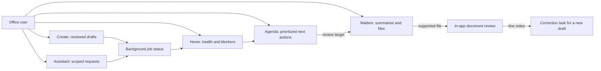
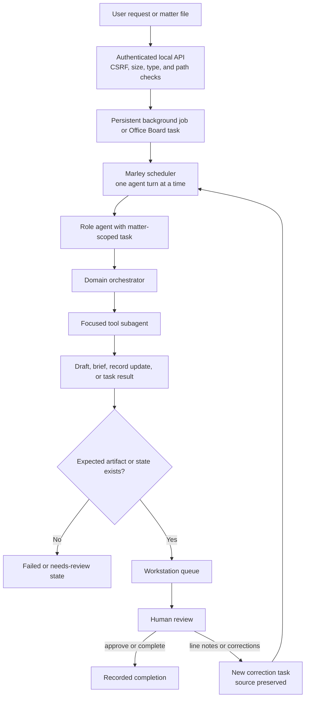
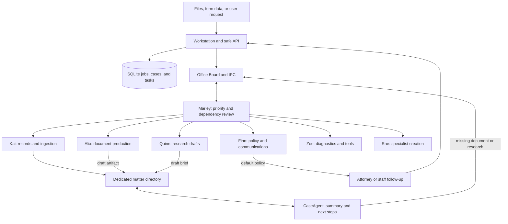
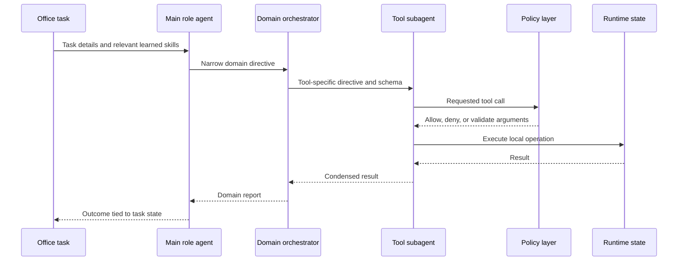
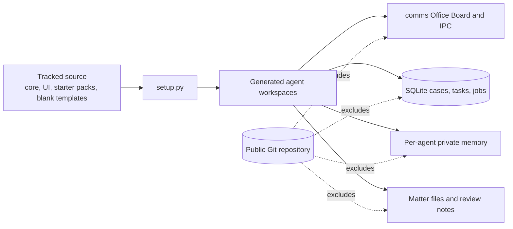

# AIMAOS — Local-First Multi-Agent Office Workstation

> A public-beta office workstation for organizing matters, coordinating local AI agents, producing reviewable documents, and keeping human decisions visible.

AIMAOS is designed for small offices that want to run useful AI-assisted workflows on their own hardware without making a recurring cloud-AI subscription part of the default architecture. It combines a browser workstation, a local task and matter database, specialized agents, document templates, and explicit human review.

The goal is not to make a small model behave like an infallible employee. AIMAOS divides work into narrower roles, gives each role limited tools, records the state of the work outside the model, and routes important outputs back to a person for review. The result is a system that can produce useful drafts and organize multi-step work while remaining honest about what is pending, blocked, simulated, or unverified.

## Public-beta status

AIMAOS is a single-operator Linux beta, not a hosted service or a professional-judgment replacement.

- The default configuration uses locally hosted Ollama models and does not require a paid AI API.
- The core application is local-first, but optional web search, calendar, remote speech, email, or vector-store integrations can use a network if an operator explicitly enables and configures them.
- Outbound email and other external mutations are disabled by default.
- Generated documents, research, extracted dates, summaries, and task recommendations require human review.
- The document viewer supports extracted-text review and annotations; it is not a full-fidelity collaborative word processor.
- The beta does not provide multi-user roles, tenant isolation, secure direct internet exposure, or guaranteed legal-deadline calculation.

See [Privacy](PRIVACY.md), [Security](SECURITY.md), [Deployment](docs/DEPLOYMENT.md), and the [public-beta checklist](docs/PUBLIC_BETA_CHECKLIST.md) before using real office data.

## Why use this design?

Many office-assistant products place chat beside documents but keep orchestration, model execution, and storage inside a vendor service. AIMAOS explores a different tradeoff:

- **Local control:** matter files, task state, agent memory, and generated drafts stay under operator-controlled storage by default.
- **No default per-message AI fee:** the standard configuration runs open-weight models through local Ollama. Hardware, electricity, administration, and optional integrations still have real costs.
- **Workstation before chatbot:** the UI centers the Agenda, matters, files, drafts, and review decisions. Chat is one tool inside that workstation.
- **Specialization for smaller models:** instead of presenting every tool and every office rule to one model, AIMAOS schedules focused agents and delegates tool use through narrower domain subagents.
- **Deterministic state around probabilistic models:** SQLite, the Office Board, job records, safe path resolution, task dependencies, document sidecars, and artifact checks carry the workflow state.
- **Human authority at consequential steps:** external communications remain staff-owned reminders, and document corrections produce a new review task rather than silently overwriting source material.

This architecture does not guarantee better output than a larger hosted model. It is intended to make locally generated work easier to inspect, constrain, reproduce, and correct.

## The all-in-one workstation

Launch the local dashboard and most daily work can happen in one browser window:

| Area | What the user can do |
| --- | --- |
| **Home** | See daemon health, active work, matter count, blockers, failures, and quick actions. |
| **Agenda** | Review prioritized tasks, dependencies, stale work, deadlines, staff follow-ups, and case-advancement steps; complete or snooze eligible human tasks. |
| **Matters** | Open a matter, read its living summary, inspect files, upload material, download a file, open it in a native application when permitted, or review supported documents in the browser. |
| **Create** | Select a known template, provide required fields, and queue production of a draft with a human-review warning. |
| **Assistant** | Ask a general question or scope a request to one matter; attach typed notes to the matter record. Model work runs as a visible background job. |
| **Settings** | Review the network boundary, privacy defaults, beta limitations, and developer-only agent creation controls. |
| **Header controls** | See ready/pausing/paused/unavailable state and cooperatively pause or resume agent work after the current turn. |



Review-required work items are clickable. When structured metadata identifies a safe file, the workstation opens that exact document; otherwise it opens the associated matter rather than presenting a dead end.

## From a request to a reviewed artifact



Long-running model calls do not block the HTTP request thread. Dashboard jobs are serialized by default to avoid loading multiple local models at once, stored in SQLite, and shown as queued, running, completed, failed, or interrupted after restart.

## How the office coordinates specialists

The starter roster names are presets; the functional roles matter more than the names.

| Preset | Functional role | Current responsibility |
| --- | --- | --- |
| **Marley** | Office manager and scheduler | Runs the daemon pulse, task lease/retry hygiene, priority dispatch, daily advancement review, calendar tools, and cooperative pause/resume. |
| **Alix** | Document producer and keeper | Reads and writes supported documents, fills DOCX templates, creates fillable intake forms, manages review notes, and assembles reviewable outputs. |
| **Kai** | Digital librarian and records keeper | Ingests files, checks duplicates, creates and updates matter records, organizes archives, and reviews changed matter folders. |
| **Quinn** | Research and intelligence reporter | Produces draft research briefs from approved local sources and, only when enabled, optional web research tools. Citations remain unverified until staff checks them. |
| **Finn** | Security and communications gateway | Triages incoming requests, reports office status, and enforces outbound communication policy. Public-beta communication work is converted into staff reminders. |
| **Zoe** | Diagnostics and tool engineer | Audits workspaces, summarizes operational records, and can install or scaffold agent tools when developer permissions are enabled. |
| **Rae** | Agent maker | Creates a new specialist workspace from the shared OfficeAgent kernel when developer mode permits it. |
| **CaseAgent** | Matter-local reviewer | Maintains one matter's summary, checklist, next steps, activity history, and private matter-specific memory. |



### Daily advancement review

Marley periodically runs a deterministic review in `core/workflow_review.py`. It does not ask a model to guess the whole office state. It examines structured tasks, dependencies, dates, case records, and completion results to:

- convert attempted client communications into high-priority staff follow-ups when direct communications are disabled;
- surface overdue and stale work;
- represent unfinished prerequisites and blockers;
- flag completed tasks whose recorded result still says the work failed or was unconfirmed;
- add matter-advancement items from recorded next steps and missing required documents;
- deduplicate recurring reminders and calendar entries.

Agenda ordering assists staff; it does not calculate or guarantee legal deadlines.

## Why layered tool use can help small local models

A conventional agent often receives a long prompt plus every tool schema. AIMAOS can instead expose one capability per domain to the main agent. The domain orchestrator chooses among the tools in that domain, and a tool subagent receives only one schema and a focused directive.



This separation provides smaller context windows for each decision and keeps raw tool output out of the main agent's transcript. By default, tool logging stores a digest and character count rather than raw output. It still has costs: a complex delegated turn can require many model calls and may take minutes on CPU hardware.

Each agent maintains a private mRAG belief store. Completed work and errors are redacted for common sensitive patterns before becoming memories. Periodic reflections distill concrete tool-use lessons into the agent's future context. This is adaptive operational memory, not proof that a model has learned a correct rule; learned lessons remain local, bounded, and reviewable.

## Matter and document workflow

Each managed matter has a directory containing the office's work product and local state:

```text
<approved matter root>/
└── example_matter/
    ├── CLIENT_FILE.md                 # human-readable living record
    ├── .client_file_state.json        # structured state
    ├── MATTER_NOTES.md                # operator notes, when used
    ├── .aimaos_review_notes.json      # private structured document notes
    ├── AIMAOS_REVIEW_NOTES.md         # agent-readable review summary
    ├── source_document.docx
    └── reviewed_draft.docx
```

The in-app review flow extracts text from supported DOCX, PDF, text, and related formats. A user can click a line, add a correction, question, approval, or general note, resolve/reopen notes, and send open notes back to an agent. The source document is preserved. If the source text changed after annotation, the UI can mark the note as potentially stale.

For full formatting work, the user can still download the file or open it in a native application when `ui.allow_native_open` is enabled and the browser is on the host machine.

## State and privacy boundaries



`starter_packs/` is the tracked source for generated agents. Root `*-AI/` workspaces, `workspace/`, `comms/`, databases, client files, logs, memories, credentials, and root `templates/` are runtime data and must not be committed.

Redaction and `.gitignore` are safeguards, not data-loss-prevention guarantees. Operators remain responsible for OS permissions, encryption, backups, retention, and reviewing changes before publishing source.

## Security defaults

The public-beta configuration in `aimaos_config.yaml` starts with:

- loopback-only HTTP (`127.0.0.1`);
- LAN serving disabled;
- optional token authentication, required for any approved non-loopback configuration;
- origin/CSRF checks on mutations and restrictive browser headers;
- approved-root path validation, upload type/size limits, and private-path filtering;
- network tools, external mutations, shell tools, and document-triggered delegation disabled;
- raw tool logs and raw-memory injection disabled;
- direct communications disabled and email set to `READ_ONLY`;
- developer mode disabled.

Do not expose port 8080 directly to the internet. Remote access requires an administrator-operated authenticated TLS reverse proxy and the controls described in [SECURITY.md](SECURITY.md).

## Models and backends

The current kernel implements Ollama and an OpenAI-compatible llama.cpp server. Tool-using roles need a model/backend combination that supports function calling.

The checked-in example configuration uses:

- `qwen3.5:4b` for most roster roles;
- `qwen3.5:2b` for Finn;
- optional `gemma3:4b` prose generation for Quinn's research writer.

These are defaults, not bundled model files or universal recommendations. Verify the models actually installed on the deployment host with `ollama list`/`ollama ps`, and record the effective model when reporting a live test. Do not infer a run's model from documentation alone.

The zero-dependency `DummyVectorStore` is deterministic hash-based retrieval, not semantic embedding search. Optional Chroma or Pinecone backends change dependencies and, for a cloud backend, the privacy boundary.

## Install and start

### Requirements

- Linux with Python 3.11–3.13
- a local Ollama service for the default configuration
- enough RAM/storage for the selected models
- LibreOffice for DOCX-to-PDF conversion and some document validation workflows
- optional system packages for OCR, audio, or image integrations

### 1. Install dependencies

```bash
git clone https://github.com/munch2u-a11y/AIMAOS.git
cd AIMAOS
bash install.sh
```

### 2. Install the configured models

```bash
ollama pull qwen3.5:4b
ollama pull qwen3.5:2b
# Optional prose-only research model:
ollama pull gemma3:4b
```

Review `aimaos_config.yaml` before use. Model availability and tool-calling support are validated during setup; AIMAOS does not download a model without operator action.

### 3. Materialize the starter office

```bash
.venv/bin/python3 setup.py --pack document_heavy
.venv/bin/python3 doctor.py
```

`setup.py` creates live root agent workspaces from `starter_packs/document_heavy/`. It is non-destructive by default; `--force` overwrites source-managed files and should be used only with a backup and a clear migration plan.

### 4. Launch the workstation

```bash
./Launch\ AIMAOS.sh
# or
.venv/bin/python3 aimaos_ui.py
```

Open `http://127.0.0.1:8080` on the same machine. The UI manages the office daemon by default. To run a bounded daemon-only smoke test:

```bash
.venv/bin/python3 run_office.py --max-cycles 5
```

### 5. Optional synthetic intake test

```bash
.venv/bin/python3 shared_tools/ingest_ssd_drive.py /path/to/synthetic/intake
```

Do not begin with real client data. Follow the synthetic smoke test in [docs/DEPLOYMENT.md](docs/DEPLOYMENT.md), review the Agenda and generated artifact, then remove the synthetic matter according to your retention process.

## Repository layout

```text
AIMAOS/
├── core/                       # shared agent, policy, storage, jobs, review kernel
├── ui/                         # workstation HTML, CSS, and JavaScript
├── starter_packs/              # tracked source for generated agent workspaces
├── shared_tools/               # reusable local/optional-integration tools
├── android/                    # experimental Android WebView shell
├── docs/                       # deployment, roadmap, mobile, and release guidance
├── System Technical Documents/# architecture and role audits
├── examples/                   # explicitly synthetic public examples
├── tests/                      # isolated unit tests and manual benchmarks
├── aimaos_ui.py                # local HTTP API and workstation server
├── run_office.py               # autonomous daemon entry point
├── setup.py                    # starter-pack materialization and model validation
└── aimaos_config.yaml          # public-beta defaults
```

## Validation

The isolated release gate does not require a live model or real office data:

```bash
.venv/bin/python3 -m pip install -r requirements-dev.lock
.venv/bin/python3 -m pytest -q
node --check ui/static/app.js
.venv/bin/python3 doctor.py
```

Pytest collects `tests/unit/`. Manual benchmarks can call real models and mutate live runtime workspaces; read [tests/README.md](tests/README.md) before running them.

## Known limitations

- Model output can be incomplete, fabricated, or falsely reported as complete.
- Artifact checks reduce false completion but do not validate legal or factual correctness.
- Research citations and extracted deadlines require verification against authoritative sources.
- Complex delegated turns can be slow on CPU-only systems.
- Browser document review is text-oriented and does not reproduce every layout, tracked change, field, image, or annotation from a native office editor.
- Optional network tools and integrations are not part of the default offline boundary.
- The Android app is an experimental shell, not a separately audited or store-ready mobile product.
- Backup, restore, upgrades, and rollback remain operator responsibilities during beta.

## Further documentation

- [Architecture audit](System%20Technical%20Documents/system_overall_technical_audit.md)
- [Current release audit and known gaps](System%20Technical%20Documents/AIMAOS_flaw_report_and_benchmarks.md)
- [Starter-pack architecture](starter_packs/README.md)
- [Shared tools](shared_tools/README.md)
- [Test and benchmark behavior](tests/README.md)
- [Mobile shell](docs/MOBILE_APP.md)
- [Product roadmap](docs/PRODUCT_BETA_ROADMAP.md)

## License

Licensed under the [Apache License 2.0](LICENSE). See [NOTICE](NOTICE) for attribution information. Bundled form templates retain their own provenance and review requirements; inclusion does not constitute legal advice or guarantee that a form is current for a particular jurisdiction.
