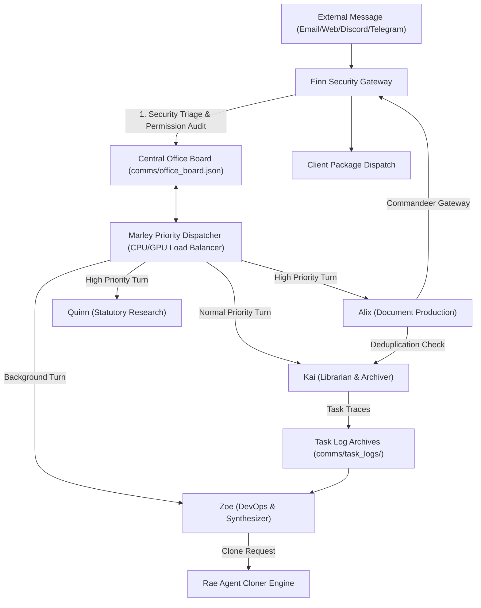

# AIMAOS - AI Multi-Agent Office Suite Operating System

> **Autonomous, 100% Offline, Model-Agnostic Multi-Agent Enterprise Office Suite & Document Production Engine**  
> Built for complete model agility. Designed to run on any local LLM runner or backend while enabling multi-agent coordination that far exceeds single-agent system limits.

---

## ⚡ System Philosophy: Multi-Agent Synergy vs. Monolithic Single Agents

Single monolithic AI agents operating locally face severe context window limitations, attention degradation, and hardware throttling when forced to perform multi-stage workflows (such as ingesting forms, checking duplicate records, researching statutes, rendering templates, compiling PDFs, triaging security, and sending client packages).

**AIMAOS** (*AI Multi-Agent Office Suite*) solves this by decomposing enterprise workflows into a specialized, collaborative mini-agent operating system. By decoupling responsibilities into autonomous agents running discrete single-thought turn cycles, AIMAOS enables local hardware to track and execute complex end-to-end business operations with precision.

---

## 🧠 How an Individual Agent Operates

Each mini-agent in AIMAOS is built as an independent, isolated processing unit:

```
┌─────────────────────────────────────────────────────────────────────────┐
│                          INDIVIDUAL MINI-AGENT                          │
├─────────────────────────────────────────────────────────────────────────┤
│ 1. Workspace Isolation : Private directory, memory store, config        │
│ 2. Ultra-Minimal Prompt: Identity + Heaviest mRAG ID Belief             │
│ 3. mRAG Context Injection: Dynamic memory & premise loading per turn     │
│ 4. Single-Thought Loop  : Discrete task/thought processing cycle         │
│ 5. Subagent-Tool Model  : Delegates subtasks to specialized subagents   │
└─────────────────────────────────────────────────────────────────────────┘
```

1. **Isolated Workspace**: Each agent maintains its own filesystem root (`Alix-AI`, `Kai-AI`, `Marley-AI`, etc.), private memory directory (`workspace/.memory`), configuration, and IPC inbox/outbox queues.
2. **Ultra-Minimal System Prompt**: Static system prompts are stripped down to identity + core mRAG ID belief (`Identity: You are {Name}, the {Role} in AIMAOS.\nCore Belief: {heaviest_id_belief}`).
3. **Dynamic mRAG Context Injection**: Turn context, client details, rules of procedure, and task histories are injected dynamically into the prompt on each turn via mRAG, eliminating static context bloat.
4. **Single-Thought Turn Execution Loop**: Each turn represents a single discrete thought or task cycle (e.g. Turn 1: Process Marley turn dispatch; Turn 2: Process inter-agent request).
5. **Subagent-as-Tools Paradigm**: Rather than clogging agent context with monolithic inline tool functions, agents delegate heavy processing to specialized subagent clones.

---

## 🏢 How Multi-Agent Office Suite Subsystems Collaborate



### 1. Central Office Board & Activity Stream (`comms/office_board.py`)
* Serves as the central state hub. Stores active task queues, turn statuses, priority levels (`CRITICAL`, `HIGH`, `NORMAL`, `BACKGROUND`), and a live activity stream ticker.

### 2. Marley Priority Turn Scheduling Engine (`Marley-AI/core/orchestrator.py`)
* Acts as the office CPU/GPU load balancer. Prevents local hardware bottlenecks by scheduling single-agent turns. High-priority user tasks (Alix document filings, Quinn statutory research) take immediate precedence over background maintenance (Zoe diagnostics).

### 3. Kai Digital Librarian & Task Archiver (`Kai-AI/core/task_archiver.py`)
* Automatically captures completed task execution traces (inputs, tools called, runtimes, outputs) into permanent JSON logs and performs fuzzy deduplication scanning on client records.

### 4. Zoe Adaptive Diagnostic Synthesizer (`Zoe-AI/core/workflow_synthesizer.py`)
* Analyzes Kai's archived task traces during background turns to generate system improvement reports, identifying operational bottlenecks and optimizing office performance.

### 5. Finn Security Officer & Comms Gateway (`Finn-AI/core/agent.py`)
* Triages unsolicited incoming communications, verifies sender security policies (`VERIFIED` vs `UNVERIFIED`), logs tasks to the Office Board, and enables active agents to commandeer outbound channels for client dispatches.

### 6. Rae Agent Maker & Workspace Cloner (`Rae-AI/tools/clone_agent.py`)
* Dynamically instantiates new mini-agent workspaces with isolated configs, IPC buses, and subagent tools on demand when specialized workloads emerge.

### 7. Asynchronous File-Queue IPC Bus (`core/comms/bus.py`)
* 100% offline, file-level messaging. Agents communicate via JSON envelope files (`msg_ID.json`) written to recipient inbox directories.

---

## 🤖 Active Agent Roster

| Agent Name | Specialized Role | Primary Responsibilities |
| :--- | :--- | :--- |
| **Alix-AI** | Document Production | Jinja2 Word template rendering, TOC injection, PDF compilation, client output dispatch |
| **Kai-AI** | Digital Librarian | Client record deduplication, cataloging, and task execution log archival |
| **Marley-AI** | Office Manager | Turn priority scheduling, CPU/GPU load balancing, and calendar event management |
| **Quinn-AI** | Researcher | Statutory legal research, case law analysis, and procedural briefing reports |
| **Zoe-AI** | DevOps Engineer | System diagnostics, task trace analysis, and adaptive improvement report synthesis |
| **Finn-AI** | Security Officer | Incoming message triage, sender permission checks, chat gateway, outbound channel commandering |
| **Rae-AI** | Agent Maker | Dynamic mini-agent workspace cloning engine (instantiating new agent instances) |

---

## 📁 System Directory Layout

```
/path/to/AIMAOS/
├── Alix-AI/                  # Document Production Agent Workspace
├── Kai-AI/                   # Digital Librarian & Task Archiver Workspace
├── Marley-AI/                # Office Manager & Priority Scheduler Workspace
├── Quinn-AI/                 # Research & Legal Intelligence Workspace
├── Zoe-AI/                   # DevOps Maintenance Engineer Workspace
├── Finn-AI/                  # Security Officer & Comms Gateway Workspace
├── Rae-AI/                   # Agent Maker & Workflow Cloner Workspace
├── comms/                    # Central IPC Communication Bus & Office Board
│   ├── office_board.json     # Atomic Bulletin Board State
│   └── task_logs/            # Kai Archived Task Traces
├── ui/                       # Embedded Web Server & Dashboard
│   ├── aimaos_ui.html        # 5-Tab Glassmorphism Dashboard
│   └── static/index.html     # Web UI Layout
├── System Technical Documents/# Full Technical Audit Suite & Architecture Docs
├── aimaos_ui.py              # Self-Contained Dashboard Server Launcher
├── main.py                   # System Entrypoint Launcher
├── setup.py / setup.sh       # Model-Agnostic Setup Wizard
├── Launch AIMAOS.sh          # One-Click Executable Shell Launcher
└── tests/                    # End-to-End Integration Test Suites
```

---

## ⚙️ Quick Start Guide

### 1. Run Setup Wizard
```bash
./setup.sh
# or
python3 setup.py
```

### 2. Launch All-in-One Dashboard & Browser
```bash
"./Launch AIMAOS.sh"
# or
python3 main.py
```
*Access the Web Dashboard at:* **`http://localhost:8080`**

### 3. Run Integration Test Suite
```bash
/path/to/user/Alix-AI/.venv/bin/python3 tests/test_multi_county_email_dispatch.py
/path/to/user/Alix-AI/.venv/bin/python3 tests/test_helix_minimal_prompts.py
```

---

## 🛡️ Model Agnosticism & Local Execution

* **Model Agnostic**: AIMAOS makes zero assumptions about the underlying LLM. It functions with any local model backend, runner, or architecture.
* **Local State Isolation**: 100% offline, private local execution. No external paid APIs or cloud dependencies required.
