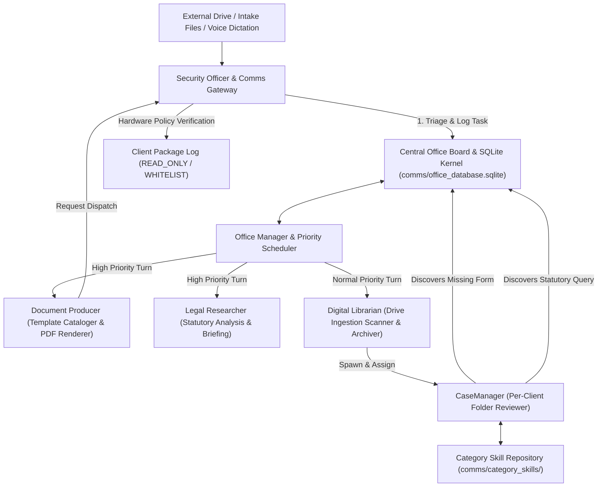

# AIMAOS — AI Multi-Agent Office Suite Operating System

> **Autonomous, 100% Offline, Model-Agnostic Multi-Agent Enterprise Office Suite & Document Production Engine**  
> *Designed to automate document production, client folder organization, legal research, and task coordination for small offices operating on budget local hardware.*

---

## 💡 Why AIMAOS is Built for Small Offices on a Budget

Small firms and solo offices often struggle with administrative overhead: organizing hundreds of unclassified client files, tracking court deadlines, preparing forms, and keeping case summaries up to date. Cloud AI services can get expensive with monthly API subscriptions, while single-agent local setups often stall when forced to manage multi-stage administrative workflows.

**AIMAOS** provides a practical, 100% offline desktop operating suite that runs entirely on your local hardware:

1. **Zero API Costs & Total Privacy**: Runs locally using open-weights models via Ollama (or any local LLM runner). No subscription fees, no cloud telemetry, and no client data leaving your local machine.
2. **Dedicated Per-Folder Case Managers**: Every client directory receives a dedicated manager (`CaseAgent`) that continuously maintains a human-readable case summary (`CLIENT_FILE.md`), active timelines, court deadlines, and required-document checklists.
3. **Independent Agent Growth & Skill Formation**: Agents dynamically learn from experience and user preferences, evolving new skills over time through background reflections without bloated static prompts.
4. **Dual Memory Storage Architecture**: Combines transactional **Relational SQL** core safety for exact case/task tracking with semantic **Vector Store Memory** (ChromaDB / Pinecone / Dummy) for context retrieval.
5. **Automated Inter-Agent Task Delegation**: When an agent identifies a required action during document review—such as needing statutory research, template rendering, or drive file ingestion—it posts a structured task to the central office board, automatically routing the work to the right specialist agent.
6. **Hardware-Enforced Outbound Email Safety**: Operates in strict `READ_ONLY` mode by default (or `WHITELIST_ONLY`), ensuring agents can never accidentally email clients or external parties.
7. **Voice Scribe Dictation**: Dictate quick audio notes directly into the web interface; the system transcribes the recording and attaches the takeaways straight to the client's case file.

---

## 📁 How Dedicated Per-Folder Case Managers Work

In AIMAOS, client file management is decoupled from global office operations. When an external drive or intake directory is ingested, the system provisions a dedicated **CaseManager (`CaseAgent`)** for each individual client folder:

```
Alix-AI/workspace/output/
├── name_change/
│   ├── sample_client/
│   │   ├── CLIENT_FILE.md              <-- Live Human-Readable Case Summary
│   │   ├── .client_file_state.json     <-- Structured JSON State
│   │   ├── .case_agent/mrag_data/      <-- Private Isolated Case Memory
│   │   ├── Petition - Name Change.docx <-- Client Document / Filing
│   │   └── Birth_Certificate.jpg       <-- Ingested Evidence
```

*(Everything under `workspace/` is generated locally and excluded from git.)*

### Key Functions of the Per-Folder CaseManager:
* **Living Markdown Record (`CLIENT_FILE.md`)**: Automatically writes and updates a single text file in the client's directory containing:
  - **Status Summary**: Overview of recent filings, discovery packages, and active litigation status.
  - **Timelines & Court Deadlines**: Extracted hearing dates, response windows, and filing deadlines synced to the office calendar.
  - **To-Do & Required Document Checklists**: Itemized tracking of pending vs. received paperwork (e.g. `[ ] Financial Affidavit — Pending`, `[x] Birth Certificate — Received`).
  - **Activity Log**: Timestamped audit trail of all file ingestions, reviews, and updates.
* **Strict Client Data Isolation**: Each CaseManager maintains its memory store inside `.case_agent/mrag_data/` within that client's directory. Confidential facts from Client A never spill into Client B's context window or overload roster agents.
* **Cross-Case Category Knowledge Inheritance**: CaseManagers working in the same practice area (e.g. `name_change`, `estate_planning`, `probate`, `guardianship`, `family`) share category-specific procedural skills (`comms/category_skills/<category>.json`), allowing new case managers to inherit practice area shortcuts on day one.

---

## 🧬 How Agents Learn & Evolve Skills Independently

AIMAOS mini-agents do not rely on fixed, static system prompts. Instead, they feature an adaptive **Helix-style mRAG memory architecture** that allows each agent to grow and acquire new skills independently based on experience and user preferences.

```
┌─────────────────────────────────────────────────────────────────────────┐
│                      HELIX AGENT SKILL FORMATION                        │
├─────────────────────────────────────────────────────────────────────────┤
│ 1. Turn Execution Log  : Records raw task outcome & user feedback       │
│ 2. Memory Store        : Saved to workspace/.memory/mrag_data/memory.json│
│ 3. Background Reflection: Scheduled LLM pass analyzes patterns         │
│ 4. Skill Consolidation : Synthesizes proven workflow into skills.json   │
│ 5. Pre-Generative Inject: Dynamic prompt injection of top skills       │
└─────────────────────────────────────────────────────────────────────────┘
```

### How New Skills Form:
1. **Raw Experience Recording**: Every time an agent executes a turn, handles an error, or receives user feedback, it logs the event to its private memory store (`memory.json`).
2. **Periodic Background Reflection**: Every N cycles (managed by the Office Manager), the agent executes a background reflection pass over recent logs.
3. **Skill Consolidation**: When the agent observes a repeating successful workflow or user preference (e.g. *"Always verify file existence before listing directory"*, or *"Format legal notices with explicit county header"*), it distills the pattern into a permanent **Skill belief** (`skills.json`).
4. **Dynamic System Prompt Injection**: On subsequent turns, the pre-generative mRAG engine injects the highest-weighted evolved skills into the agent's ultra-minimal system prompt, continuously tailoring agent behavior to user preferences.

---

## 💾 Dual Memory Storage Architecture: Relational SQL Core vs. Vector Store Memory

AIMAOS implements a dual-layer storage hub that balances transactional safety with semantic retrieval:

```
┌─────────────────────────────────────────────────────────────────────────┐
│                    AIMAOS DUAL MEMORY STORAGE HUB                       │
├─────────────────────────────────────────────────────────────────────────┤
│                                                                         │
│  1. STRUCTURED RELATIONAL CORE (SQLite — comms/office_database.sqlite)   │
│     • Manages cases, active task queues, and legal template catalogs    │
│     • Guarantees atomic row locking, zero data corruption, & fast SQL   │
│     • Synchronizes state to CLIENT_FILE.md for staff inspection         │
│                                                                         │
│  2. SEMANTIC MEMORY ENGINE (mRAG Vector Stores)                         │
│     • Handles semantic search & context injection over unstructured text│
│     • Flexible Vector Store Backends (core/mrag/core/vector_store.py):  │
│       - DummyVectorStore: SHA-256 pseudo-vector hashing (0-dep default) │
│       - ChromaVectorStore: Local ChromaDB with real semantic embeddings │
│       - PineconeVectorStore: Cloud vector index for enterprise scale    │
└─────────────────────────────────────────────────────────────────────────┘
```

* **SQL Core**: Manages exact structured data where zero error tolerance is acceptable (case numbers, task ownership, deadlines, template lists).
* **Vector Store**: Manages fuzzy semantic recall, experience retrieval, and prompt injection across unstructured client documents, research notes, and past review transcripts.

---

## 🔄 Inter-Agent Task Passing & Coordination Flow



---

## 🏢 Role-Agnostic Starter Roster Matrix

Agent names in AIMAOS are customizable starter presets assigned during setup. The system resolves all agents dynamically by their **Job Title and Functional Role**:

| Functional Job Title | Starter Name Preset | Core Role & Responsibilities |
| :--- | :--- | :--- |
| **Document Producer & Keeper** | `Alix` (Default) | Ingests intake forms, Jinja2 Word rendering, TOC OpenXML injection, PDF compilation, template library cataloging. |
| **Digital Librarian & Archiver** | `Kai` (Default) | External drive scanning, client deduplication, SQLite case registration, task execution trace archival. |
| **Office Manager & Scheduler** | `Marley` (Default) | Autonomous office daemon pulse loop, priority turn scheduling (`CRITICAL`, `HIGH`, `NORMAL`, `BACKGROUND`), task lease hygiene, load balancing. |
| **Legal & Statutory Researcher** | `Quinn` (Default) | Statutory research, Florida Rules of Civil & Family Procedure, jurisdictional filing rules, formal legal memorandum writing. |
| **DevOps Engineer & Synthesizer** | `Zoe` (Default) | Task trace analysis, Hermes operational improvement reports, performance bottleneck detection, tool catalog installation. |
| **Security Officer & Comms Gateway** | `Finn` (Default) | Security triage, sender permission checks, hardware-enforced email policies (`READ_ONLY`, `WHITELIST_ONLY`), Voice Scribe audio dictation gateway. |
| **Agent Maker & Cloner** | `Rae` (Default) | Dynamic workspace cloner. Instantiates new mini-agent workspaces fully integrated into main config, IPC bus, and Office Board. |
| **Dedicated Case Manager** | `CaseAgent` (Dynamic) | Per-client mini-agent. Generates `CLIENT_FILE.md` summaries, required-document checklists, court deadlines, and inherits category practice skills. |

---

## ⚙️ Quick Start Guide

### 0. Prerequisites
A local LLM runner. [Ollama](https://ollama.com) is the default:

```bash
ollama pull qwen3.5:2b       # every agent's default model
ollama pull qwen3.5:0.8b     # optional: faster model for short-turn agents
```

> **Model requirement:** agent turn-loops need a model that supports tool
> calling. The qwen3.5 family works; some models (e.g. gemma3) return HTTP 400
> for tool calls and can only fill prose-only roles such as the researcher's
> `research_model`. Assign models per agent in `aimaos_config.yaml`.

### 1. Install
```bash
git clone <this-repo> && cd AIMAOS
python3 -m venv .venv && source .venv/bin/activate
pip install -r requirements.txt
```

### 2. Run the Setup Wizard — this creates your agents
A fresh checkout contains **no agent workspaces**. The wizard materializes the
starting roster for your kind of office from `starter_packs/`, assigns models,
validates them against what Ollama actually has installed, and sets the
outbound email policy:

```bash
python3 setup.py                                    # default pack: document_heavy
python3 setup.py --pack document_heavy --force      # re-apply over existing workspaces
python3 setup.py --email-security-mode WHITELIST_ONLY \
                 --approved-recipients you@example.com
```

### 3. Start the Autonomous Office (Office Manager's daemon)
```bash
python3 run_office.py
python3 run_office.py --max-cycles 5   # bounded run, useful for a first look
```

### 4. Launch All-in-One Dashboard & Web UI
```bash
./Launch\ AIMAOS.sh
# or: python3 aimaos_ui.py
```
*Access Web Dashboard at:* **`http://localhost:8080`**

### 5. Optional: ingest an existing drive or folder of work
```bash
python3 shared_tools/ingest_ssd_drive.py /path/to/your/drive
```

> **Outbound email is deny-all by default.** `aimaos_config.yaml` ships with
> `security_mode: READ_ONLY` and an empty `approved_recipients` list; real SMTP
> dispatch additionally requires `AIMAOS_SMTP_SEND=1` plus credentials in
> `~/.config/aimaos/credentials.env`. Until you change that, packages are
> logged locally and honestly reported as `SIMULATED`.

---

## 🛡️ Model & Repository Safety

* **Model Agnostic**: Compatible with any local LLM runner (Ollama, vLLM, LM Studio).
* **100% Offline & Private**: Zero external cloud dependencies, zero telemetry, zero paid API credits consumed. All client records remain strictly local.
* **Public Git Ready**: Built-in `.gitignore` excludes all client files, output documents, SQLite databases, credentials, agent memory stores, and task logs. Agent workspaces themselves are generated by `setup.py` and never committed.

---

## 🧪 Tests & Benchmarks

See [`tests/README.md`](tests/README.md). Several suites drive real local LLM
turns, so a full delegated turn can take minutes on CPU — the table there lists
which suites make model calls and their expected runtimes.

---

## ⚠️ Accuracy & Human Review

AIMAOS drives small local language models, which can misreport their own work —
a 2B model will occasionally summarize a step as done that it never performed.
Grounded-reporting prompts and artifact checks reduce this, but do not eliminate
it. **Treat every generated document, research brief, and status summary as a
draft requiring human review.** The bundled Florida court forms are blank format
examples, not legal advice, and statutory citations produced by a local model
must be verified against the official sources before any filing or client use.

---

## 📄 License

Licensed under the [Apache License, Version 2.0](LICENSE). See [NOTICE](NOTICE)
for attribution details.
