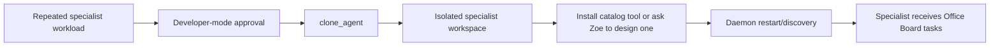

# Technical Audit: Agent Maker (Rae Preset)

**Tracked source:** [`starter_packs/document_heavy/Rae-AI/`](../starter_packs/document_heavy/Rae-AI/)
**Live workspace after setup:** `<office root>/Rae-AI/`
**Configured model:** `qwen3.5:4b` in the checked-in example configuration.

## Role

Rae creates a new local specialist workspace when a workload genuinely needs a separate role. Creation is a developer operation, not an ordinary end-user action. `clone_agent` is blocked unless `ui.developer_mode` is enabled by the operator.

## Implemented flow

[`tools/clone_agent.py`](../starter_packs/document_heavy/Rae-AI/tools/clone_agent.py) validates the requested name and creates a root `<Name>-AI/` workspace containing:

- `core/agent.py`, subclassing the shared `core.office_agent.OfficeAgent`;
- role/model configuration;
- a `capabilities.yaml` initially containing file-research capability;
- `tools/`, `workspace/.memory/`, and IPC directory structure;
- seed identity/capability state and Office Board registration where applicable.

The daemon discovers valid root `*-AI` workspaces on restart; no hard-coded roster edit is required for hiring.

## Capability surface

Rae's tracked `capabilities.yaml` contains:

- `file_research`: local approved-path browsing/reading tools;
- `agent_making`: `clone_agent`, shared tool-catalog listing, and tool installation.

Common catalog tools can be installed directly. Zoe's tool-engineering flow is intended for a new custom schema or implementation.

## Security and limitations

- Agent creation writes executable Python and configuration into the live office. It must remain developer-gated and reviewed before restart.
- A clone has an empty operational history and no evidence that it performs its role correctly.
- Installing a scaffold produces an explicitly incomplete tool until its implementation is written and tested.
- Cloning does not create a new OS account, process sandbox, or authorization boundary; isolation is by workspace and policy within the same service account.
- New tool paths and output paths remain subject to central tool policy and approved-root validation.

## Verification

Test name validation, developer-mode denial, generated file structure, capability loading, daemon discovery, and a synthetic first task. Never clone against a production office without a backup and an explicit cleanup plan.
