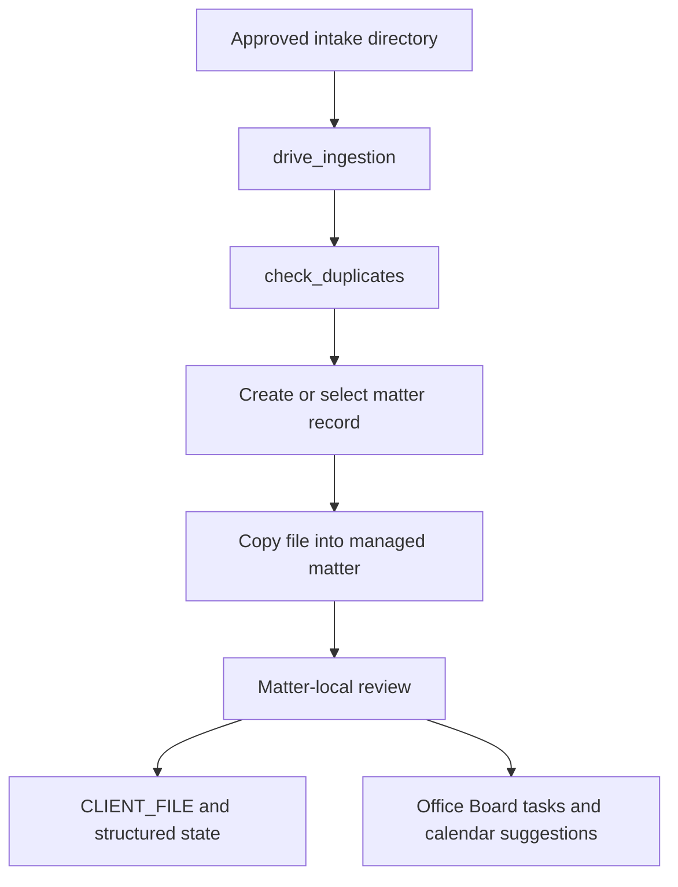

# Technical Audit: Digital Librarian and Records Keeper (Kai Preset)

**Tracked source:** [`starter_packs/document_heavy/Kai-AI/`](../starter_packs/document_heavy/Kai-AI/)
**Live workspace after setup:** `<office root>/Kai-AI/`
**Configured model:** `qwen3.5:4b` in the checked-in example configuration.

## Role

Kai creates and organizes matter records, ingests approved files, checks for likely duplicate records, and asks matter-local review agents to update summaries and next steps. Kai's record state is operational assistance, not a substitute for a document-management retention policy.

## Record structure

[`business/client_file.py`](../starter_packs/document_heavy/Kai-AI/business/client_file.py) maintains:

- a structured `.client_file_state.json` sidecar;
- a human-readable `CLIENT_FILE.md`;
- client slug, category/location, state, next steps, required documents, preferred channel, and activity entries;
- SQLite case index synchronization;
- explicit close/reopen/recategorize operations.

Writes use atomic helpers where implemented. Moving/closing records is a consequential filesystem operation and should not race an active review.

## Ingestion and review

[`tools/drive_ingestion.py`](../starter_packs/document_heavy/Kai-AI/tools/drive_ingestion.py) scans an operator-approved directory, classifies material, copies data into the managed archive, and can create matter records. [`tools/process_incoming_file.py`](../starter_packs/document_heavy/Kai-AI/tools/process_incoming_file.py) requires an existing matter rather than inventing a client from a bare file.

[`business/case_review.py`](../starter_packs/document_heavy/Kai-AI/business/case_review.py) and `manage_case_records action=review` perform a reasoning pass over trusted record text/file listings. The summary is a helpful draft; objective files and activity entries remain the evidence.

## Capability surface

Kai's active `library` domain contains duplicate checking, matter-record management, incoming-file processing, and drive ingestion. A backup module exists in source but is disabled by public-beta policy and is not registered in the active capability list.

`core/task_archiver.py` can write task-trace JSON for diagnostic use, but the current daemon does not automatically call it for every completion. Do not describe the archive as comprehensive.

## Security and limitations

- Approved-root/path policy applies before file tools execute.
- Fuzzy duplicate matching can miss a duplicate or flag unrelated names.
- A matter directory is not an OS sandbox; all agents run under the same account.
- File classification and model-written summaries require staff review.
- Backups, record locks during moves, retention, and deletion need operator procedures.

## Verification

Use synthetic directories to test duplicate detection, create/update/review, close/reopen/recategorize, path denial, interrupted writes, and audit findings. Confirm no real matter path enters Git.
