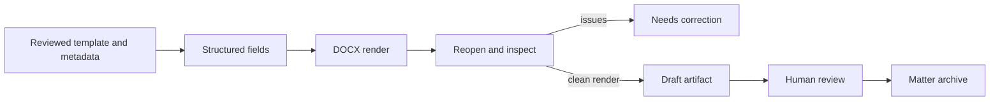

# Technical Audit: Document Producer and Keeper (Alix Preset)

**Tracked source:** [`starter_packs/document_heavy/Alix-AI/`](../starter_packs/document_heavy/Alix-AI/)
**Live workspace after setup:** `<office root>/Alix-AI/`
**Configured model:** `qwen3.5:4b` in the checked-in example configuration.

## Role

Alix produces reviewable documents from approved templates and structured context, reads supported office files, manages template metadata, and archives completed drafts into matter records. Rendering success does not establish legal sufficiency.

## Document pipeline

[`business/document_engine.py`](../starter_packs/document_heavy/Alix-AI/business/document_engine.py) uses `docxtpl`/`python-docx` to render DOCX, inject optional TOC fields, add fillable content controls for intake templates, re-open saved documents for validation, and optionally call LibreOffice for PDF conversion.

[`tools/populate_template.py`](../starter_packs/document_heavy/Alix-AI/tools/populate_template.py):

1. resolves configured template/output directories through approved-root policy;
2. normalizes the template identifier and suggests close matches;
3. reads required fields from adjacent `template.yaml`;
4. sanitizes the output name;
5. renders DOCX and optionally PDF;
6. reports leftover tags, visible missing-field placeholders, and structural reopen errors.

## Template and form tools

- `catalog_templates.py` writes a JSON inventory in the selected template directory. It does **not** itself synchronize SQLite.
- `build_fillable_form.py` converts supported intake placeholders into protected Word content controls and is intended as a developer/template-maintenance operation.
- `read_filled_form.py` reads real content-control values from returned forms; typed statements remain unverified matter content.
- `review_templates.py` and some template mutation tools exist but are disabled by default.
- `document_text.py`/the workstation provide extracted-text browser review separate from native DOCX editing.

The tracked library includes selected blank Florida family/name-change forms plus example estate documents and intake questionnaires. Each item requires provenance, revision, jurisdiction, and human validation before real use. The existence of an intake questionnaire does not imply a court-ready filing template for that matter type.

## Dispatch and communication

`dispatch_document.py` can archive a generated DOCX/PDF into a matter and update its record. Providing a recipient makes it an external mutation, so central tool policy denies that path by default. Email has an additional `READ_ONLY`/whitelist/software switch and explicit SMTP enablement.

Archive success and email delivery are separate states. A blocked or simulated communication must never be logged as sent.

## Capability domains

- `file_research`;
- `document_production`;
- `memory_and_skills` (restricted tools remain policy-gated);
- `office_comms` (external actions disabled by default);
- optional voice/scanned-document tools, subject to local dependencies and policy.

## Limitations and verification

- Native formatting, floating objects, tracked changes, field codes, and scans may not extract/render perfectly.
- OCR and model-derived fields require independent confirmation.
- PDF conversion depends on LibreOffice.
- Template revision can make an otherwise valid render obsolete.

Run fillable-form, document-text, document-review, and representative LibreOffice conversion tests. Inspect the final visual document and authoritative form source before filing or delivery.
