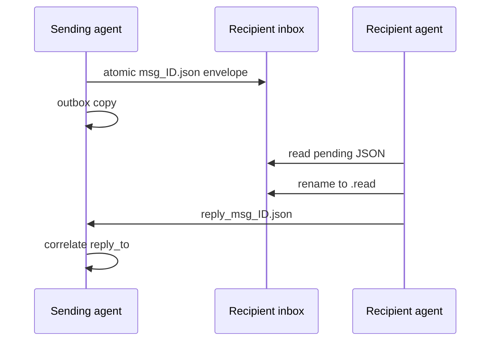

# Technical Audit: Inter-Agent State, IPC, and Matter Knowledge

## 1. Implemented subsystems

| Subsystem | Source | Runtime state |
| --- | --- | --- |
| SQLite manager | [`core/db/office_sqlite.py`](../core/db/office_sqlite.py) | `comms/office_database.sqlite` plus WAL files |
| Office Board | [`core/comms/office_board.py`](../core/comms/office_board.py) | `comms/office_board.json` and lock |
| IPC bus | [`core/comms/bus.py`](../core/comms/bus.py) | `comms/<Agent>/inbox` and `outbox` |
| Category skills | [`core/db/category_skills.py`](../core/db/category_skills.py) | `comms/category_skills/<category>.json` |
| Matter agent | [`core/case_agent.py`](../core/case_agent.py) | matter `.case_agent/mrag_data/` |
| Dashboard jobs | [`core/jobs.py`](../core/jobs.py) | SQLite `jobs` table |

All runtime paths are private and ignored by Git. “Offline” applies to these local subsystems; a tool invoked through them may still use a network only when separately enabled.

## 2. SQLite schema

- `cases`: slug, display name, matter type, category, status, case number, timestamps, and local path;
- `tasks`: ID, title/description, owner, priority/weight, status, timestamps, and lease expiry;
- `templates`: ID, filename, category, relative path, size, and modification time;
- `jobs`: ID, kind/title, status, result/error, and lifecycle timestamps;
- `schema_meta`: migration markers.

Connections use foreign keys, WAL mode, and a busy timeout. The JSON Office Board remains the active compatibility representation and synchronizes tasks into SQLite after locked mutations. A sync failure is logged, so the two representations can temporarily differ.

## 3. Office Board lifecycle

Board writes acquire an exclusive POSIX `flock`, reload current data, mutate it, bound history, and atomically replace the JSON file. Tasks move from `active_tasks` to `completed_tasks` only on completion; failures remain active with retry metadata. Activity history is capped.

This is designed for local Linux. Cross-platform locking semantics and network filesystems are outside the supported beta boundary.

## 4. IPC message flow

Envelope fields include ID, sender, recipient, action, payload, timestamp, and status. `ask_peer_and_wait` polls for a correlated reply and times out if no process is servicing the recipient inbox.

Malformed JSON is logged but not moved to a dedicated dead-letter directory, so it can be retried on later reads. Read markers are pruned by privacy housekeeping after the configured retention period. Delivery is local at-least-observed file state, not a durable distributed message broker.

## 5. Matter and category knowledge

Each `CaseAgent` uses a memory directory inside one matter. Category-skill JSON can share general procedural lessons across matters of the same category. Public-beta privacy defaults prevent raw matter content from becoming shared learned skills.

Directory separation reduces accidental cross-matter context, but all agents share an OS account. Approved-root/path checks and matter-scoped API resolution are essential; this is not cryptographic tenant isolation.

## 6. Consistency and recovery limitations

- There is no global transaction spanning matter files, Office Board JSON, calendar JSON, SQLite, and IPC.
- Atomic individual writes reduce torn files but cannot make a multi-file workflow atomic.
- The daemon can retry leased work, but tools must be designed for idempotency to avoid duplicate side effects.
- Backup must capture SQLite consistently and include required runtime files; copying while active can produce an inconsistent recovery point.
- Schema downgrade and multi-host operation are not supported beta workflows.

## 7. Verification

Test concurrent board mutations, task sync, malformed messages, timeout/reply correlation, retention pruning, SQLite interruption, category isolation, cross-matter path denial, and backup/restore using synthetic data.
