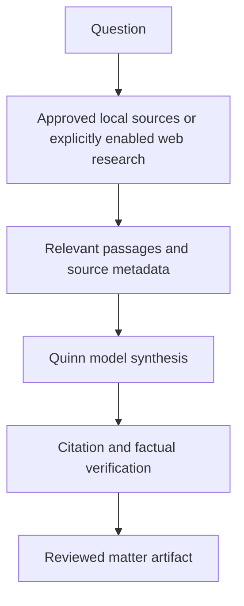

# Technical Audit: Research and Intelligence Reporter (Quinn Preset)

**Tracked source:** [`starter_packs/document_heavy/Quinn-AI/`](../starter_packs/document_heavy/Quinn-AI/)
**Live workspace after setup:** `<office root>/Quinn-AI/`
**Configured models:** `qwen3.5:4b` for tool-capable turns and optional `gemma3:4b` for prose in the checked-in example configuration.

## Role

Quinn creates structured draft research briefs. The role does not provide authoritative legal research, and the current `research_brief` tool is model synthesis rather than a citation-grounded research database.

## Implemented brief writer

[`tools/research_brief.py`](../starter_packs/document_heavy/Quinn-AI/tools/research_brief.py):

- accepts a topic, scope, and optional existing matter name;
- calls the configured prose model with a Florida-oriented briefing structure;
- instructs the model to mark uncertain citations `[verify]`;
- writes to Quinn's reports directory or an existing matter's `research/` directory;
- creates an explicitly labelled placeholder if the model is unavailable;
- adds a matter activity entry only when a matching record already exists.

The function does not independently fetch statutes, cases, or local reference documents. Grounding requires a preceding approved file/web research step and human citation checking.

## Capability domains

- `file_research`: approved local files;
- `research`: the brief writer;
- `web_research`: optional search/fetch/RSS tools.

Network tools are denied by default (`security.allow_network_tools: false`). Enabling them changes the privacy boundary and does not make arbitrary web material authoritative.

## Limitations

- The prose model can invent or misstate citations, holdings, deadlines, and procedure.
- The tool's jurisdiction prompt is Florida-oriented and not sufficient for jurisdiction selection.
- A report saved to disk is a draft, not a verified answer.
- Web search snippets are not evidence; sources must be opened and checked.
- No citator, case-law subscription, or authoritative statute-update service is bundled.

## Verification

For each real brief, record the question, jurisdiction/date, approved sources, passages relied upon, model tag, and staff reviewer. Check every citation against an authoritative current source before use.
