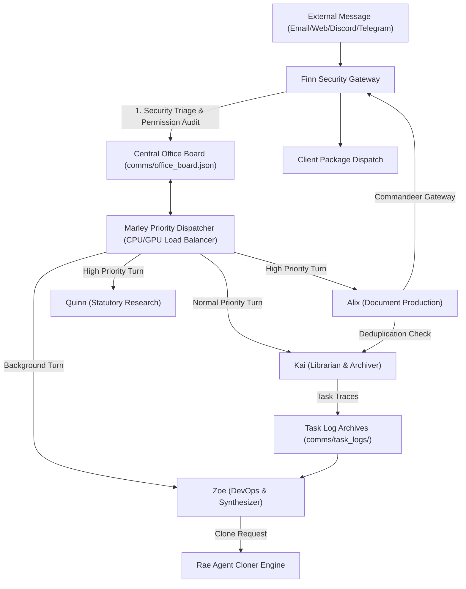

# AIMAOS Model-Agnostic Architecture & Multi-Agent OS Synergy Audit

## Executive Summary

**AIMAOS** (*AI Multi-Agent Office Suite Operating System*) is an autonomous, 100% offline, model-agnostic multi-agent desktop operating suite. It is engineered to overcome the hardware and cognitive limits of single monolithic local AI agents. Rather than relying on massive static system prompts or single-agent execution loops, AIMAOS orchestrates seven specialized mini-agents running isolated single-thought turn loops, collaborating through an offline file-queue IPC bus and a central Office Board bulletin system.

---

## 1. Why Multi-Agent OS Synergy Outperforms Single Local Agents

| Metric / Dimension | Single Monolithic Local Agent | AIMAOS Multi-Agent Office Suite OS |
| :--- | :--- | :--- |
| **Context Window Load** | High risk of prompt bloat, attention loss, and instructions degradation | Ultra-minimal single-thought context windows (~300–500 tokens per turn) |
| **Task Scaling** | Fails or stalls on multi-stage complex workflows (intake -> audit -> research -> render -> dispatch) | Decoupled execution: Alix renders, Kai catalogs, Quinn researches, Marley schedules, Finn triages |
| **Hardware Overhead** | Constant compute throttling on large monolithic prompts | Turn-based CPU/GPU load balancing managed by Marley Priority Dispatcher |
| **Extensibility** | Fixed tool definitions and static persona | Dynamic agent spawning on demand via Rae Agent Cloner Engine |
| **Model Independence** | Tied to a single runner or specific model parameters | 100% Model Agnostic: works across any local LLM engine or runner |

---

## 2. Individual Agent Architecture

Each mini-agent in AIMAOS operates as a self-contained, model-agnostic processing unit:

```
┌─────────────────────────────────────────────────────────────────────────┐
│                          INDIVIDUAL MINI-AGENT                          │
├─────────────────────────────────────────────────────────────────────────┤
│ 1. Workspace Isolation : Private directory, memory store, config        │
│ 2. Ultra-Minimal Prompt: Identity + Heaviest mRAG ID Belief             │
│ 3. mRAG Context Injection: Dynamic memory & premise loading per turn     │
│ 4. Single-Thought Loop  : Discrete task/thought processing cycle         │
│ 5. Subagent-Tool Model  : Delegates subtasks to specialized subagents   │
└─────────────────────────────────────────────────────────────────────────┘
```

1. **Workspace Isolation**: Each agent resides in its own workspace directory (`Alix-AI`, `Kai-AI`, `Marley-AI`, `Quinn-AI`, `Zoe-AI`, `Finn-AI`, `Rae-AI`), maintaining an isolated memory store (`workspace/.memory`) and IPC inbox/outbox queues.
2. **Ultra-Minimal System Prompt**: System prompts contain zero hardcoded instructions, consisting only of identity and core mRAG ID belief (`Identity: You are {Name}, the {Role} in AIMAOS.\nCore Belief: {heaviest_id_belief}`).
3. **Dynamic mRAG Context Injection**: Premises, preferences, and task details are dynamically loaded per turn via mRAG, eliminating context saturation.
4. **Single-Thought Turn Execution Loop**: Each turn represents a single discrete thought or task cycle.
5. **Subagent-as-Tools Paradigm**: Instead of cluttering LLM contexts with monolithic helper code, agents delegate heavy processing to specialized subagent clones.

---

## 3. Multi-Agent Office Suite Subsystems Breakdown



### 3.1. Central Office Board & Activity Stream (`comms/office_board.py`)
State hub tracking tasks, turn assignments, priority weights (`CRITICAL`, `HIGH`, `NORMAL`, `BACKGROUND`), and live activity streams.

### 3.2. Marley Priority Turn Scheduling Engine (`Marley-AI/core/orchestrator.py`)
Hardware CPU/GPU load balancer. Assigns execution turns based on priority, ensuring high-value user workloads take immediate precedence over background diagnostics.

### 3.3. Kai Digital Librarian & Task Archiver (`Kai-AI/core/task_archiver.py`)
Captures completed task execution traces into permanent JSON archives and performs fuzzy deduplication scanning on client records.

### 3.4. Zoe Adaptive Diagnostic Synthesizer (`Zoe-AI/core/workflow_synthesizer.py`)
Analyzes task execution traces during background turns to generate system improvement reports and self-healing metrics.

### 3.5. Finn Security Officer & Comms Gateway (`Finn-AI/core/agent.py`)
Triages unsolicited incoming messages, verifies sender security policies (`VERIFIED` vs `UNVERIFIED`), logs tasks to the Office Board, and enables active agents to commandeer outbound channels for client package dispatches.

### 3.6. Rae Agent Maker & Workspace Cloner (`Rae-AI/tools/clone_agent.py`)
Instantiates new mini-agent workspaces with isolated configs, IPC buses, and subagent tools on demand.

### 3.7. Offline Inter-Agent File-Queue IPC Bus (`core/comms/bus.py`)
100% offline file-level messaging bus operating via JSON envelopes in `/path/to/AIMAOS/comms/<AgentName>/inbox/`.

---

## 4. Model Agnosticism Guarantee

AIMAOS makes zero assumptions about the underlying LLM engine, parameter size, or runner architecture. All agent interfaces, IPC buses, and turn orchestrators operate purely on standard JSON schemas and file queues, ensuring complete model agility across any local setup.
