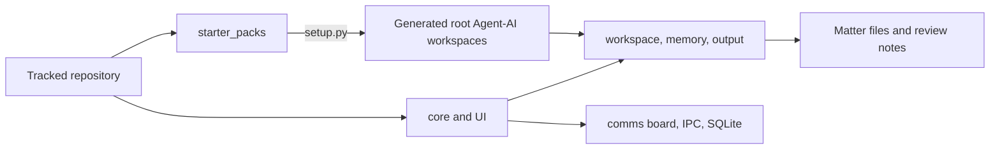
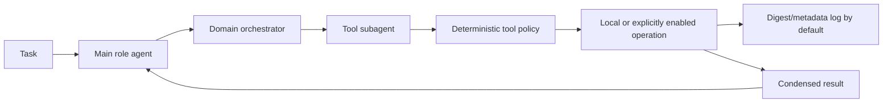

# AIMAOS System Architecture Technical Audit

**Snapshot:** public-beta source tree, 2026-07-31
**Purpose:** describe implemented behavior, source/runtime boundaries, trust assumptions, and known limitations.
**Canonical overview:** [`README.md`](../README.md)

## 1. Executive summary

AIMAOS is a single-operator, local-first office workstation. It combines:

- a browser UI and local HTTP API (`aimaos_ui.py`, `ui/`);
- a deterministic task, job, matter, and review layer (`core/`);
- a sequential office daemon (`run_office.py`, Marley's `office_daemon.py`);
- role-specific agents materialized from `starter_packs/`;
- local model calls through Ollama or an OpenAI-compatible llama.cpp endpoint;
- matter-local files and per-agent memory stores;
- explicit human review for documents, communications, and uncertain completion.

The system is not a cloud office suite, a multi-user authorization system, a full word processor, or a source of professional advice. Its core value is coordinating locally generated, reviewable work around deterministic state while limiting the authority given to small language models.

## 2. Source tree versus live office

The public repository contains code, blank/sample templates, synthetic examples, and starter-pack definitions. Setup creates live agent workspaces and runtime state.



| Boundary | Tracked source | Generated/private runtime |
| --- | --- | --- |
| Agent code | `starter_packs/document_heavy/<Name>-AI/` | root `<Name>-AI/` |
| Templates | blank/source templates under `starter_packs/` | root agent template registry and populated outputs |
| Matter state | schemas and synthetic examples | matter directories, `CLIENT_FILE.md`, sidecar JSON, review notes |
| Office state | database/board code | `comms/`, SQLite database, jobs, IPC messages, task logs |
| Learning | mRAG implementation and seed beliefs | each agent's `workspace/.memory/` |

Public-release review must use `git ls-files` and reachable history, not merely a filesystem listing: ignored runtime data can still exist in an older Git commit.

## 3. Workstation and API

### 3.1 User-facing areas

`ui/aimaos_ui.html` and `ui/static/app.js` implement Home, Agenda, Matters, Create, Assistant, and Settings views plus document-review and authentication dialogs.

- **Home:** daemon state, active work, matter count, attention count, blockers, and quick actions.
- **Agenda:** prioritized workstation items built by `core/workflow_review.py`.
- **Matters:** matter list/detail, living summary, safe file listing, upload, download, native open (when allowed), and browser review.
- **Create:** template catalog and background draft generation.
- **Assistant:** general or matter-scoped jobs and typed matter notes.
- **Settings:** security/privacy state and developer-gated specialist creation.
- **Daemon control:** cooperative pause/resume after the current turn.

Browser responses use public projection helpers rather than returning raw board/database records. DOM rendering uses text nodes/`textContent` instead of HTML injection.

### 3.2 HTTP boundary

`aimaos_ui.AIMAOSUIHandler` provides the API. Controls include:

- loopback default and explicit LAN/TLS policy checks;
- optional bearer/header token authentication;
- CSRF token and origin validation for mutations;
- security headers and a restrictive Content Security Policy;
- JSON/body/upload size limits;
- configured upload extension allowlist;
- approved-root, matter-boundary, traversal, and sensitive-path validation;
- redacted errors instead of raw tracebacks;
- developer feature gates.

The server is a single-operator boundary. A token is not a substitute for user accounts, authorization roles, per-matter permissions, or tenant isolation.

### 3.3 Background jobs

`core/jobs.py` uses a one-worker `ThreadPoolExecutor` for dashboard model work. Job metadata is persisted in SQLite. On restart, unfinished records are marked interrupted instead of falsely completed. This queue is serialized internally, but it is separate from the office daemon; deployment capacity planning must consider both processes.

## 4. Office state and scheduling

### 4.1 SQLite and compatibility state

`core/db/office_sqlite.py` stores structured cases, tasks, templates, and dashboard jobs in `comms/office_database.sqlite`. The file-based `OfficeBoard` remains the shared task/activity compatibility layer, protected by file locking and atomic replacement. The IPC bus exchanges JSON envelopes under `comms/<Agent>/inbox/`.

SQLite provides transactional local storage; the project does not claim zero corruption risk. Backups must be taken consistently, and schema downgrade is not supported without a tested migration.

### 4.2 Daemon pulse

`starter_packs/document_heavy/Marley-AI/core/office_daemon.py`:

1. requeues expired leases and retryable failures;
2. processes agent IPC inboxes;
3. runs the deterministic advancement review on its configured cadence;
4. chooses the next task using priority and aging;
5. executes one assigned agent turn;
6. rotates reflection work;
7. backs off when idle.

Only one daemon-managed agent turn runs at a time. A pause request is checked at turn boundaries, published through `comms/daemon_status.json`, and held in `comms/daemon_control.json` until resume.

### 4.3 Daily advancement review

`core/workflow_review.py` converts raw task/case/calendar state into a maximum of 200 sorted workstation items. Its deterministic rules cover:

- direct-communication requests held for attorney/staff action;
- task prerequisites and blockers;
- overdue and stale work promotion;
- completion records that still contain failure/unconfirmed language;
- matter next steps and outstanding required documents;
- safe `review_target` metadata for one-click navigation;
- idempotent reminders and linked calendar entries.

This is workflow assistance, not legal-deadline computation.

## 5. Agent kernel and delegation

### 5.1 OfficeAgent

`core/office_agent.py` supplies the shared role-agent kernel. A generated role agent receives:

- its name, role, and effective model from `aimaos_config.yaml`;
- an Office Board and IPC client;
- a private matter-independent mRAG belief store;
- a capability-domain registry loaded from its live `capabilities.yaml`;
- a local LLM client;
- experience recording and periodic reflection;
- task claim, result, failure, and status transitions.

Common SSN, payment-number, and email patterns are redacted before experience text is stored. Matter content is not promoted into shared skills by default. Heuristic redaction does not make arbitrary prose anonymous.

### 5.2 Layered delegation

When delegation is enabled, the main role agent sees capability domains rather than every raw tool schema. `core/delegation.py` creates:

1. a **domain orchestrator** that focuses on one capability and selects tools;
2. a **tool subagent** that sees one tool schema, validated directive, and relevant tool-use beliefs;
3. a **return summarizer** that condenses the domain transcript for the main agent.



The design narrows context but increases latency and model-call count. It does not guarantee correct tool selection or correct output.

### 5.3 Models

`core/llm.py` implements Ollama and an OpenAI-compatible llama.cpp server. The current checked-in configuration assigns `qwen3.5:4b` to most roles, `qwen3.5:2b` to Finn, and an optional `gemma3:4b` prose model to Quinn. Tool-calling support must be verified for the effective model/backend. Models are not bundled.

## 6. Matter records and document review

### 6.1 Matter records

Kai's tracked source under `starter_packs/document_heavy/Kai-AI/` creates and maintains matter directories, structured `.client_file_state.json`, human-readable `CLIENT_FILE.md`, next steps, required documents, and activity entries. `core/case_agent.py` supplies a matter-local reasoning/memory layer.

Matter isolation is implemented through directory boundaries and path checks. It is not a formal mandatory-access-control system; the OS account and configured storage roots remain part of the trust boundary.

### 6.2 Document production

Alix's source under `starter_packs/document_heavy/Alix-AI/` provides DOCX/Jinja2 rendering, fillable intake fields, document reading/writing, PDF assembly/conversion helpers, and template metadata. Some tools or network-capable integrations are disabled by policy in the public-beta defaults.

Bundled court-form templates require provenance and revision review. Successful rendering means the file was produced; it does not establish legal sufficiency or current form status.

### 6.3 In-app review

`core/document_text.py` extracts review text. `core/document_review.py` stores bounded, matter-local annotations using atomic writes and a lock:

- `.aimaos_review_notes.json` is the structured source;
- `AIMAOS_REVIEW_NOTES.md` is an agent-readable rendering;
- notes preserve line number, quoted line text, hash, kind, status, and timestamps;
- correction submission deduplicates active feedback tasks;
- source files are not silently overwritten.

DOCX/PDF extraction is not a layout-accurate editor and cannot preserve every native-office feature.

## 7. Security and privacy model

The default configuration disables network tools, external mutations, shell tools, raw tool logs, raw-memory injection, matter-content learning, document-triggered delegation, direct communications, and developer mode. Email is `READ_ONLY`.

Optional integrations exist in source. Enabling one changes the data-flow boundary and requires separate review. “Local-first” therefore describes the default deployment, while “offline” is conditional on configuration and operator behavior.

Private runtime data is excluded by `.gitignore`, but release safety additionally requires:

- current-tree secret/PII scans;
- embedded DOCX/PDF metadata/content review;
- reachable-history scans for deleted runtime data;
- commit-author email review;
- explicit staging and diff inspection;
- encrypted storage/backups and restricted OS permissions.

## 8. Android shell

`android/` is an experimental Kotlin/AppCompat WebView wrapper using XML layouts, ViewBinding, encrypted preferences, optional biometric gating, and file chooser support. It is not Jetpack Compose and is not a store-ready security boundary.

The server's recommended remote pattern remains loopback behind an authenticated TLS reverse proxy. The shell needs end-to-end validation that authentication reaches WebView API `fetch` requests, URL navigation stays within an approved origin, and release signing/network policy are production-ready.

## 9. Implemented controls versus remaining risk

| Area | Implemented | Residual risk |
| --- | --- | --- |
| Model work | narrow roles, delegated tools, task state, failures | hallucination, false completion, latency |
| Files | approved roots, traversal/sensitive-path checks | operator misconfiguration, OS-account access |
| Browser | loopback, token option, CSRF/origin, CSP, safe rendering | not multi-user, reverse-proxy/operator error |
| Privacy | ignored runtime paths, redaction, bounded logs | heuristic redaction, backups/history can retain data |
| Documents | source preservation, annotations, review warning | extraction/layout loss, legal/factual error |
| Communications | default disabled, staff reminders | unsafe if policies are deliberately relaxed |
| Learning | private stores, category restrictions | incorrect learned lessons and local sensitive context |

## 10. Release verification

Normal source checks:

```bash
.venv/bin/python3 -m pip install -r requirements-dev.lock
.venv/bin/python3 -m pytest -q
node --check ui/static/app.js
.venv/bin/python3 doctor.py
git diff --check
```

Release review must also complete `docs/PUBLIC_BETA_CHECKLIST.md`, run the synthetic workflow in `docs/DEPLOYMENT.md`, validate template provenance, inspect the public Git history, and test backup/restore and rollback.
