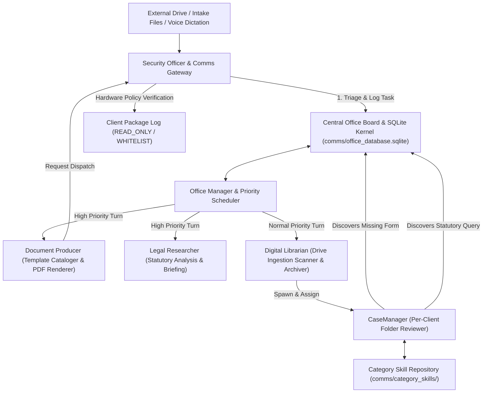

# AIMAOS Architecture & Multi-Agent OS Synergy Technical Audit

## Executive Summary

**AIMAOS** (*AI Multi-Agent Office Suite Operating System*) is an autonomous, 100% offline, model-agnostic multi-agent desktop operating suite. It is engineered to automate legal case management, document production, client folder organization, and administrative task coordination for small offices operating on budget local hardware.

Rather than relying on massive static system prompts or single-agent execution loops that stuff thousands of tokens into a single local prompt window, AIMAOS orchestrates specialized mini-agents running isolated single-thought turn loops, collaborating through an offline file-queue IPC bus, a central relational SQLite database kernel, and an Office Board bulletin system.

---

## 1. Dedicated Per-Folder Case Manager Architecture (`CaseAgent`)

Client file management in AIMAOS is decoupled from global office operations. When an external drive or intake directory is ingested, the system provisions a dedicated **CaseManager (`CaseAgent`)** for each individual client folder:

```
Alix-AI/workspace/output/
├── name_change/
│   ├── sample_client/
│   │   ├── CLIENT_FILE.md              <-- Live Human-Readable Case Summary
│   │   ├── .client_file_state.json     <-- Structured JSON State
│   │   ├── .case_agent/mrag_data/      <-- Private Isolated Case Memory
│   │   ├── Petition - Name Change.docx <-- Client Document / Filing
│   │   └── Birth_Certificate.jpg       <-- Ingested Evidence
```

*(Everything under `workspace/` is generated at runtime and excluded from git.)*

### Key Technical Operations of `CaseAgent`:
1. **Living Markdown Synchronization (`CLIENT_FILE.md`)**: On each review turn, `CaseAgent` evaluates directory changes and updates `CLIENT_FILE.md` with:
   - **Status Summary**: High-level synthesis of case progress, recent filings, and active discovery state.
   - **Timelines & Court Deadlines**: Hearing dates and filing milestones extracted into structured date strings.
   - **To-Do & Required Document Checklists**: Explicit `[ ] Pending` vs `[x] Received` itemizations.
   - **Activity Log**: Chronological audit trail of all file ingestions and reviews.
2. **Context Isolation**: Memory is stored inside `.case_agent/mrag_data/` within that specific client's folder. Facts from Client A never contaminate Client B's prompt window or pollute global roster context windows.
3. **Cross-Case Category Skill Sharing**: `CaseAgent` instances operating in the same practice area (e.g. `name_change`, `estate_planning`, `probate`, `guardianship`, `family`) inherit category procedural knowledge via `comms/category_skills/<category_slug>.json`.

---

## 2. Helix Skill Formation & Background Reflection Architecture

Mini-agents in AIMAOS do not rely on hardcoded, bloated system prompts. Instead, they feature an adaptive **Helix-style mRAG memory engine** that evolves new skills independently based on experience and user preferences.

```
┌─────────────────────────────────────────────────────────────────────────┐
│                      HELIX AGENT SKILL FORMATION                        │
├─────────────────────────────────────────────────────────────────────────┤
│ 1. Turn Execution Log  : Records raw task outcome & user feedback       │
│ 2. Memory Store        : Saved to workspace/.memory/mrag_data/memory.json│
│ 3. Background Reflection: Scheduled LLM pass analyzes patterns         │
│ 4. Skill Consolidation : Synthesizes proven workflow into skills.json   │
│ 5. Pre-Generative Inject: Dynamic prompt injection of top skills       │
└─────────────────────────────────────────────────────────────────────────┘
```

### How New Skills Form:
1. **Raw Experience Recording**: Every turn, tool invocation, error handling event, or user feedback item is written to `workspace/.memory/mrag_data/memory.json`.
2. **Background Reflection Loop**: Scheduled every N cycles by Marley (the Office Manager), the agent executes an LLM reflection pass over recent logs.
3. **Skill Consolidation**: Proven patterns, procedural shortcuts, and user preferences are promoted into permanent **Skill beliefs** (`skills.json`).
4. **Dynamic Pre-Generative Prompt Injection**: On subsequent turns, the pre-generative injector (`core/mrag/core/pre_generative_injection.py`) dynamically injects the highest-weighted evolved skills into the agent's ultra-minimal prompt window (~100–400 tokens), seamlessly tailoring agent performance to user preferences.

---

## 3. Dual Memory Storage Architecture: Relational SQL Core vs. Vector Store Memory

AIMAOS combines structured relational database integrity with semantic vector retrieval:

```
┌─────────────────────────────────────────────────────────────────────────┐
│                    AIMAOS DUAL MEMORY STORAGE HUB                       │
├─────────────────────────────────────────────────────────────────────────┤
│                                                                         │
│  1. STRUCTURED RELATIONAL CORE (SQLite — comms/office_database.sqlite)   │
│     • Manages cases, active task queues, and legal template catalogs    │
│     • Guarantees atomic row locking, zero data corruption, & fast SQL   │
│     • Synchronizes state to CLIENT_FILE.md for staff inspection         │
│                                                                         │
│  2. SEMANTIC MEMORY ENGINE (mRAG Vector Stores)                         │
│     • Handles semantic search & context injection over unstructured text│
│     • Flexible Vector Store Backends (core/mrag/core/vector_store.py):  │
│       - DummyVectorStore: SHA-256 pseudo-vector hashing (0-dep default) │
│       - ChromaVectorStore: Local ChromaDB with real semantic embeddings │
│       - PineconeVectorStore: Cloud vector index for enterprise scale    │
└─────────────────────────────────────────────────────────────────────────┘
```

---

## 4. Role-Agnostic Starter Roster Matrix

| Functional Job Title | Starter Name Preset | Core Role & Responsibilities |
| :--- | :--- | :--- |
| **Document Producer & Keeper** | `Alix` (Default) | Jinja2 Word template rendering, TOC OpenXML injection, PDF compilation, template cataloger (`catalog_templates.py`). |
| **Digital Librarian & Archiver** | `Kai` (Default) | External drive scanner (`drive_ingestion.py`), client record deduplication, task execution trace archival. |
| **Office Manager & Scheduler** | `Marley` (Default) | Autonomous office daemon pulse loop (`office_daemon.py`), priority turn scheduling (`CRITICAL`, `HIGH`, `NORMAL`, `BACKGROUND`), load balancing. |
| **Legal & Statutory Researcher** | `Quinn` (Default) | Statutory research, Florida Rules of Civil & Family Procedure, memorandum writing. |
| **DevOps Engineer & Synthesizer** | `Zoe` (Default) | Task trace analysis, Hermes operational improvement report synthesis, performance bottleneck detection. |
| **Security Officer & Comms Gateway** | `Finn` (Default) | Security triage, sender permission checks, hardware-enforced email security policies (`READ_ONLY`, `WHITELIST_ONLY`), Voice Scribe audio dictation gateway. |
| **Agent Maker & Cloner** | `Rae` (Default) | Workspace cloner (`clone_agent.py`), fully integrating new clones into main config, IPC bus queues, and Office Board. |
| **Dedicated Case Manager** | `CaseAgent` (Dynamic) | Per-client mini-agent. Generates `CLIENT_FILE.md` summaries, required-document checklists, court deadlines, and inherits category practice skills. |

---

## 5. Multi-Agent Office Suite Subsystems Breakdown



---

## 6. Delegation Architecture: Every Tool Is a Subagent

The single most distinctive property of an AIMAOS turn is that **the main agent
never sees a tool schema or raw tool output**. The tool-calling pipeline is
decomposed so each stage spends a full context window on exactly one job
(`core/delegation.py`, `core/office_agent.py`):

```
Main agent ──(directive)──► Orchestrator subagent ──(directive)──► Tool subagent
    ▲   capability beliefs      domain-scoped mRAG       schema + tool-use
    │   only — no schemas,      re-injection (full       beliefs, no persona;
    │   no raw output           budget for ONE domain)   executes + condenses
    │                                                            │
    └──(first-person report)◄── Return summarizer ◄──────────────┘
                                   verbatim output → workspace/.memory/tool_logs/
```

| Stage | Sees | Produces |
| :--- | :--- | :--- |
| **Main agent** | A dynamic ability list — one `delegate_<domain>` entry per capability domain, each flavored with the agent's own strongest matching skill belief | A plan, then a parsed-down directive per domain |
| **Orchestrator subagent** | Its one domain: the directive, its specialists, and domain-scoped beliefs re-pulled from the same mRAG store | Fully-specified directives to individual tool subagents (max 3 rounds) |
| **Tool subagent** | One tool's schema plus the owner's accumulated beliefs about how that tool actually behaves — deliberately *not* a "You are the…" persona | The exact tool call; output over ~1500 chars is chunk-summarized before it travels upward |
| **Return summarizer** | The domain transcript | A first-person past-tense report — the only text the main agent receives |

**Why the extra layers pay off.** Under a large pool of competing beliefs, an
orchestrator has the same context budget as the main agent but spends all of it
on one domain, so tool-use beliefs that lost the competition for the main
agent's whole-task injection get pulled in where they matter. Each stage is
also a natural place to record experience: every tool use writes an outcome
belief, and reflection distills those into reusable `skills` entries.

**Verbatim preservation.** Condensing happens only on the path *upward*. The
full raw output of every tool call is written to
`<Agent>-AI/workspace/.memory/tool_logs/<timestamp>_<tool>.json` before any
summarization, so the record of what actually happened is never lossy.

**Capability registry.** Domains and their tools are declared per agent in
`<Agent>-AI/capabilities.yaml` with office-root-relative tool paths (resolved
at load by `core/delegation.load_capabilities`). Adding a capability to an
agent is a YAML edit plus a tool module — no kernel change. Zoe's
`design_tool_subagent` performs both steps programmatically, which is how a
newly cloned agent gets equipped.

---

## 7. Autonomous Office Daemon

`Marley-AI/core/office_daemon.py` (entry point: `run_office.py`) is the pulse
that makes the suite autonomous rather than test-driven. Each cycle:

1. **Board hygiene** — requeue tasks whose lease exceeded `office.task_lease_sec`;
   requeue failures under `office.max_task_retries`; abandon those past it.
2. **Inbox processing** — every hired agent drains its IPC inbox, executing the
   requested tool where it has one.
3. **Priority dispatch** — the scheduler agent assigns the next turn
   (`CRITICAL` → `HIGH` → `NORMAL` → `BACKGROUND`). An office configured without
   a scheduler agent falls back to the daemon's own equivalent dispatcher.
4. **One real turn** — the assigned agent runs a single delegated LLM turn.
   Exactly one turn executes at a time; this is the CPU/GPU protection charter.
5. **Reflection & housekeeping** — on a fixed cadence and on idle cycles,
   agents distill recent experience into skills; idle pulses back off up to
   `office.idle_backoff_max_sec`.

The roster is discovered from the filesystem, so a different starter pack or a
newly cloned specialist is hired automatically on the next start.

---

## 8. Known Limitations

Stated plainly, because they affect how output should be treated:

* **Small-model self-reporting.** 2B-class local models occasionally report a
  step as done that they never performed. Grounded-reporting prompts (plan
  first, summarize only what tool results confirm) reduce this substantially
  but do not eliminate it. Generated documents and status summaries are drafts
  requiring human review.
* **Throughput.** A fully delegated turn is roughly 30 model calls — minutes per
  task on CPU inference. The design trades latency for per-stage focus.
* **Semantic recall.** The zero-dependency `DummyVectorStore` is hash-based, so
  belief retrieval is keyword-adjacent rather than semantic until a real
  embedding backend (ChromaDB) is configured.
* **Statutory content.** Citations produced by a local model carry `[verify]`
  markers and must be checked against official sources before any filing.
